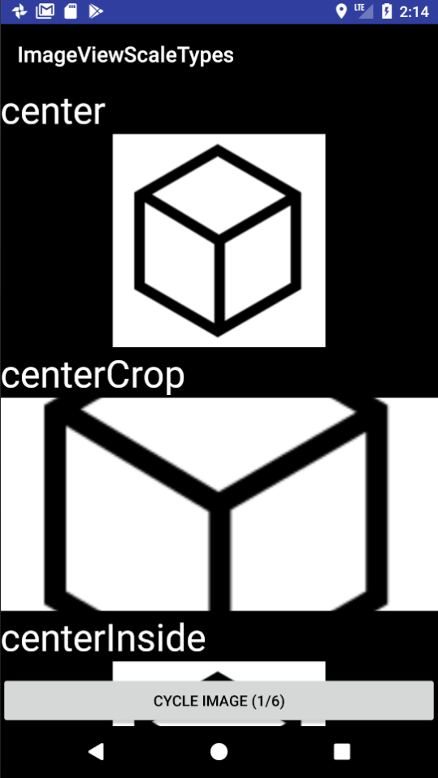
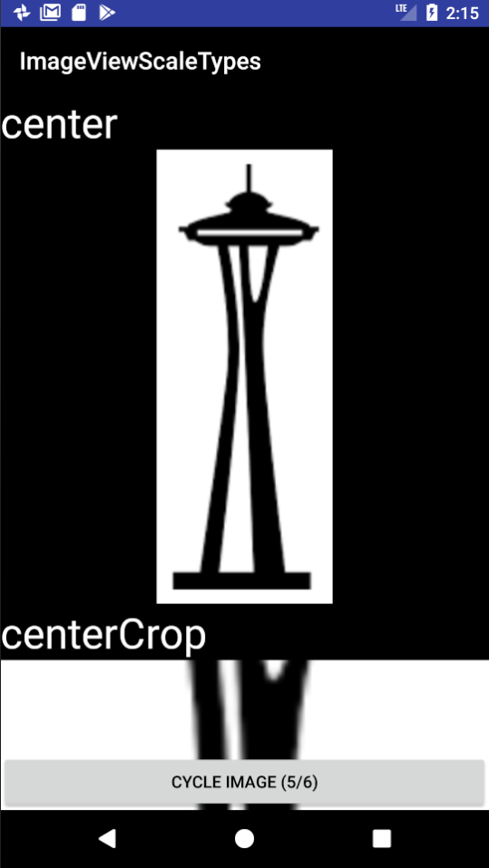
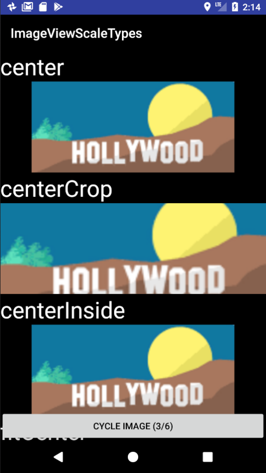

# ImageView scaleTypes Demo
This app shows off all the different possible values for the `scaleType`
attribute on an `ImageView`.

Notice that setting `adjustViewBounds` to `true` eliminates extra padding
that appears above or below images for certain scale types. (Note: the app
actually restarts when `adjustViewBounds` is toggled to `false` because it
must reset the `ImageView` to a clean slate.)

For a quick visual reference refer to this webpage which shows off the
scale types similarly: <https://robots.thoughtbot.com/android-imageview-scaletype-a-visual-guide>

And, here's a screenshot of that website:

Here's how the Android docs describe the scale types: <https://developer.android.com/reference/android/widget/ImageView.ScaleType.html>

<!-- Copied from Android docs -->
<table id="enumconstants" class="responsive constants">
  <tbody><tr><th colspan="2"><h3>Enum values</h3></th></tr>

  <tr class="api apilevel-1">
    <td><code><a href="https://developer.android.com/reference/android/widget/ImageView.ScaleType.html">ImageView.ScaleType</a></code>&nbsp;</td>
    <td width="100%">
      <code>CENTER</code>
      
Center the image in the view, but perform no scaling.&nbsp;

    </td>
  </tr>

  <tr class="api apilevel-1">
    <td><code><a href="https://developer.android.com/reference/android/widget/ImageView.ScaleType.html">ImageView.ScaleType</a></code>&nbsp;</td>
    <td width="100%">
      <code>CENTER_CROP</code>
      
Scale the image uniformly (maintain the image's aspect ratio) so
 that both dimensions (width and height) of the image will be equal
 to or larger than the corresponding dimension of the view
 (minus padding).&nbsp;

    </td>
  </tr>

  <tr class="api apilevel-1">
    <td><code><a href="https://developer.android.com/reference/android/widget/ImageView.ScaleType.html">ImageView.ScaleType</a></code>&nbsp;</td>
    <td width="100%">
      <code>CENTER_INSIDE</code>
      
Scale the image uniformly (maintain the image's aspect ratio) so
 that both dimensions (width and height) of the image will be equal
 to or less than the corresponding dimension of the view
 (minus padding).&nbsp;

    </td>
  </tr>

  <tr class="api apilevel-1">
    <td><code><a href="https://developer.android.com/reference/android/widget/ImageView.ScaleType.html">ImageView.ScaleType</a></code>&nbsp;</td>
    <td width="100%">
      <code>FIT_CENTER</code>
      
Scale the image using <code><a href="https://developer.android.com/reference/android/graphics/Matrix.ScaleToFit.html#CENTER">CENTER</a></code>.&nbsp;

    </td>
  </tr>

  <tr class="api apilevel-1">
    <td><code><a href="https://developer.android.com/reference/android/widget/ImageView.ScaleType.html">ImageView.ScaleType</a></code>&nbsp;</td>
    <td width="100%">
      <code>FIT_END</code>
      
Scale the image using <code><a href="https://developer.android.com/reference/android/graphics/Matrix.ScaleToFit.html#END">END</a></code>.&nbsp;

    </td>
  </tr>

  <tr class="api apilevel-1">
    <td><code><a href="https://developer.android.com/reference/android/widget/ImageView.ScaleType.html">ImageView.ScaleType</a></code>&nbsp;</td>
    <td width="100%">
      <code>FIT_START</code>
      
Scale the image using <code><a href="https://developer.android.com/reference/android/graphics/Matrix.ScaleToFit.html#START">START</a></code>.&nbsp;

    </td>
  </tr>

  <tr class="api apilevel-1">
    <td><code><a href="https://developer.android.com/reference/android/widget/ImageView.ScaleType.html">ImageView.ScaleType</a></code>&nbsp;</td>
    <td width="100%">
      <code>FIT_XY</code>
      
Scale the image using <code><a href="https://developer.android.com/reference/android/graphics/Matrix.ScaleToFit.html#FILL">FILL</a></code>.&nbsp;

    </td>
  </tr>

  <tr class="api apilevel-1">
    <td><code><a href="https://developer.android.com/reference/android/widget/ImageView.ScaleType.html">ImageView.ScaleType</a></code>&nbsp;</td>
    <td width="100%">
      <code>MATRIX</code>
      
Scale using the image matrix when drawing.&nbsp;

    </td>
  </tr>
<!-- ========== METHOD SUMMARY =========== -->
</tbody></table>

Here's what the app looks like

